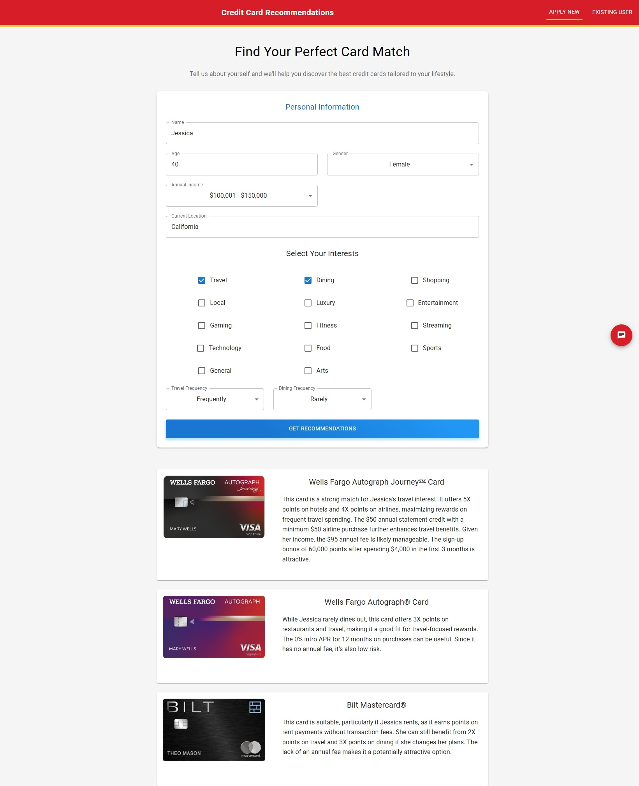

# 🚀 FinAI

## 📌 Table of Contents
- [Introduction](#introduction)
- [Demo](#demo)
- [Inspiration](#inspiration)
- [What It Does](#what-it-does)
- [How We Built It](#how-we-built-it)
- [Challenges We Faced](#challenges-we-faced)
- [How to Run](#how-to-run)
- [Tech Stack](#tech-stack)
- [Team](#team)

---
#TEST

## 🎯 Introduction

FinAI is an intelligent credit card recommendation system that leverages AI to provide personalized financial advice. Our platform combines the power of Google's Gemini AI with comprehensive financial data to match users with the perfect credit cards based on their lifestyle, spending patterns, and preferences.

The system features:
- Smart credit card recommendations based on user profiles and interests
- Real-time sentiment analysis for personalized suggestions
- Interactive AI chat assistant for financial guidance
- Existing customer portal with transaction analysis
- Location-aware benefits and rewards matching

Built with modern web technologies and AI capabilities, FinAI aims to simplify the credit card selection process while ensuring users get the most value from their financial products. Whether you're a travel enthusiast, a dining connoisseur, or a tech-savvy gamer, our system tailors recommendations to match your unique lifestyle.

## 🎥 Demo
🔗 [Live Demo](#)  
📹 [Video Demo](#)  
🖼️ Screenshots:


### New User Experience & Recommendation Results

*Intelligent profile collection and interest selection*

### Customer Portal

*Secure existing customer access portal*
### Customer Portal


### Chat Interface


*Interactive AI-powered financial guidance system*

## 💡 Inspiration
In today's complex financial landscape, choosing the right credit card can be overwhelming. Many people struggle to find cards that truly match their lifestyle and spending patterns. We noticed that:
- Users often select cards without understanding their full benefits
- Traditional recommendation systems lack personalization
- Financial advice is not readily accessible in real-time
- Existing customers need better insights into their spending patterns

This inspired us to create FinAI, combining AI technology with financial expertise to provide smart, personalized credit card recommendations.

## ⚙️ What It Does
Our system offers several key features:
- **Smart Profile Analysis**: Analyzes user profiles including age, income, location, and interests
- **AI-Powered Recommendations**: Uses Google Gemini AI to suggest personalized credit cards
- **Sentiment Analysis**: Processes user inputs to understand preferences and financial outlook
- **Interactive Chat Assistant**: Provides real-time financial guidance and card recommendations
  - Voice-to-Text Support
  - Natural Language Processing
  - Multi-language Support
  - Real-time Voice Recognition
- **Existing Customer Portal**: Allows current customers to:
  - View their transaction history
  - Get personalized card upgrade suggestions
  - Access spending pattern analysis
- **Location-Based Benefits**: Matches card benefits with user location and preferences

## 🛠️ How We Built It
We developed FinAI using a modern tech stack:
- **Frontend**: 
  - React.js with Material-UI for responsive design
  - React Hook Form for form handling
  - Framer Motion for smooth animations
  - Axios for API communication
  - Web Speech API for voice recognition

- **Backend**:
  - Flask server with Python
  - Google Gemini AI for intelligent recommendations
  - RAG (Retrieval-Augmented Generation) for enhanced responses
  - JSON-based data storage for card portfolios and user data
  - Speech-to-Text processing

- **Integration**:
  - RESTful API architecture
  - CORS handling for secure cross-origin requests
  - Real-time data processing and analysis

## 🚧 Challenges We Faced
During development, we encountered and overcame several challenges:
- **AI Integration**: Fine-tuning Gemini AI responses for accurate financial advice
- **Data Management**: Structuring complex financial data for efficient retrieval
- **User Experience**: Balancing comprehensive data collection with user-friendly interface
- **Real-time Processing**: Optimizing response times for AI-powered recommendations
- **Session Management**: Implementing secure and persistent chat sessions
- **Cross-browser Compatibility**: Ensuring consistent UI/UX across different platforms

## 🏃 How to Run

### Prerequisites
- Node.js (v14 or higher)
- npm (Node Package Manager)
- Python (v3.8 or higher)
- pip (Python Package Manager)

### Frontend Setup
1. Clone the repository
   ```sh
   git clone https://github.com/ewfx/aidhp-persona-genie.git
   ```
2. Install dependencies  
   ```sh
   cd code/src/FrontEnd
   npm install  
   ```
3. Run the project  
   ```sh
   npm start 
   ```
### Backed Setup 
 1. Go to the backend directory
    ```sh
    cd code/src/Backend
    ```
 2. Install dependencies
    ```sh
    pip install -r requirements.txt
    ```
 3. Run the project
    ```sh
    python server.py    

 4. Backend Runs on Localhost:3001

 5. Frontend Runs on Localhost:3000

 6. Open the browser and go to Open the browser and go to localhost:3000


## 🏗️ Tech Stack
- 🔹 Frontend: 
  - React.js
  - Material-UI (MUI)
  - React Hook Form
  - Framer Motion
  - Axios
  - Zod (Form Validation)

- 🔹 Backend: 
  - Python
  - Flask
  - Flask-CORS
  - Pandas

- 🔹 Database: 
  - JSON Files
    - Credit Card Portfolio
    - Investment Portfolio
    - Customer Data
    - Transaction Records

- 🔹 AI/ML:
  - Google Gemini API 2.0
  - RAG (Retrieval-Augmented Generation)
  - Sentiment Analysis

- 🔹 Development Tools:
  - Git
  - npm
  - pip


## 👥 Team
- **Arun Kapuganty** 
- **Pradeep Rampelli** 
- **Haque, Mahafujul**
- **Praveen Behara** 
- **Shoba Warrier**
