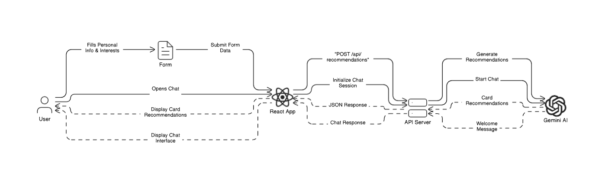

# 🏗️ FinAI Architecture

## System Flow Overview

## Flow Diagram

## Components Description

### 1. Frontend Layer
- **React Application**
  - User Interface Components
  - Form Handling & Validation
  - State Management
  - API Integration
  - Real-time Updates

### 2. Backend Layer
- **Flask Server**
  - RESTful API Endpoints
  - CORS Management
  - Request Processing
  - Data Validation
  - Response Formatting

### 3. AI/ML Layer
- **Google Gemini Integration**
  - Credit Card Recommendations
  - Sentiment Analysis
  - Chat Assistance
  - RAG Implementation

### 4. Data Layer
- **JSON Data Store**
  - Credit Card Portfolio
  - Customer Data
  - Transaction Records
  - Investment Portfolio

## Data Flow
1. User inputs profile data through React frontend
2. Data is validated and sent to Flask backend
3. Backend processes request and calls Gemini AI
4. AI generates recommendations using RAG and data store
5. Response flows back through backend to frontend
6. Frontend renders personalized recommendations

## Security Considerations
- CORS Implementation
- API Key Management
- Data Validation
- Secure Communication

## Integration Points
- Frontend ↔ Backend: REST API
- Backend ↔ Gemini AI: API Integration
- Backend ↔ Data Store: Direct File Access